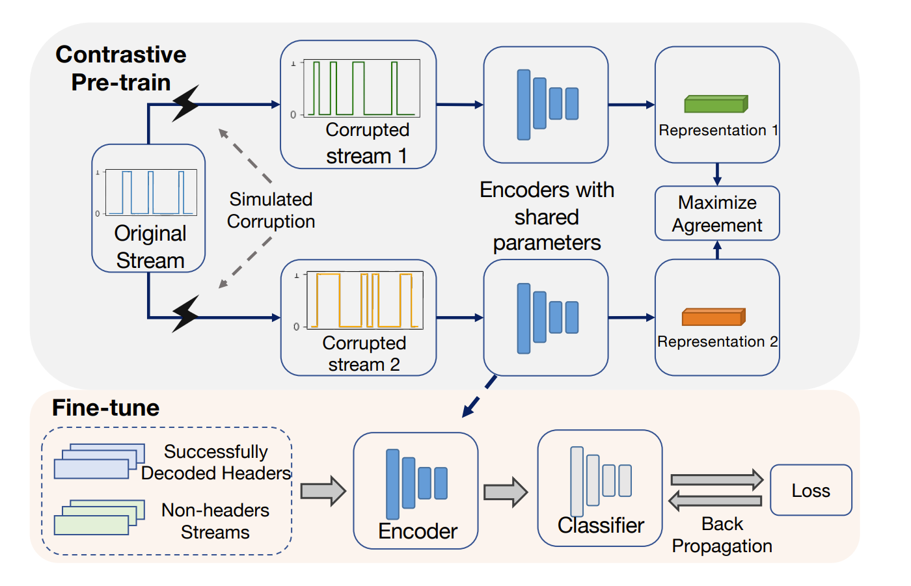

# This code is for the work of CLExtract [(A Robust Decoding System for Highly Corrupted Satellite Stream Recovery)](https://openreview.net/forum?id=r-gYaqIG_G)

  
<b>Figure 1.</b> Overall framework of our work.

## Requirements
numpy, scikit-learn, torch, tqdm, matplotlib

## Data
Because of the sensibility of the satellite communication data, the data is not concluded in this repository. If you want to get more information, please contact the corresponding author. Thanks for understanding.

